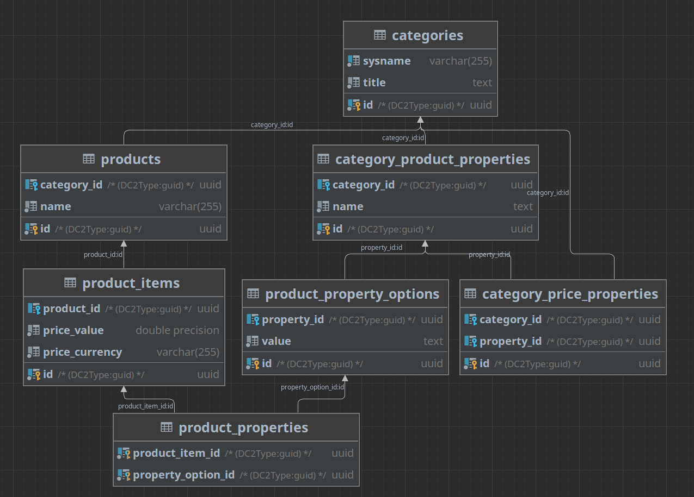

# Test Task

## Installation
### Prepare build
    cp .env.example .env && cp api/.env.example api/.env

### Start containers
    make init
    make up
    
    // use docker
    docker-compose build
    docker-compose up -d

### Composer installation
    make api-composer-install

    // use docker
    docker-compose run --rm api-php-fpm composer install

### Migrate
    make api-migrations-migrate

    // use docker
    docker-compose run --rm api-php-fpm php bin/console doctrine:migrations:migrate --no-interaction

### Loading fixtures
    make api-fixture-load

    // use docker
    docker-compose run --rm api-php-fpm php bin/console doctrine:fixtures:load

# Database schema

# Testing
[testRequest.http](api%2FtestRequest.http) for API testing